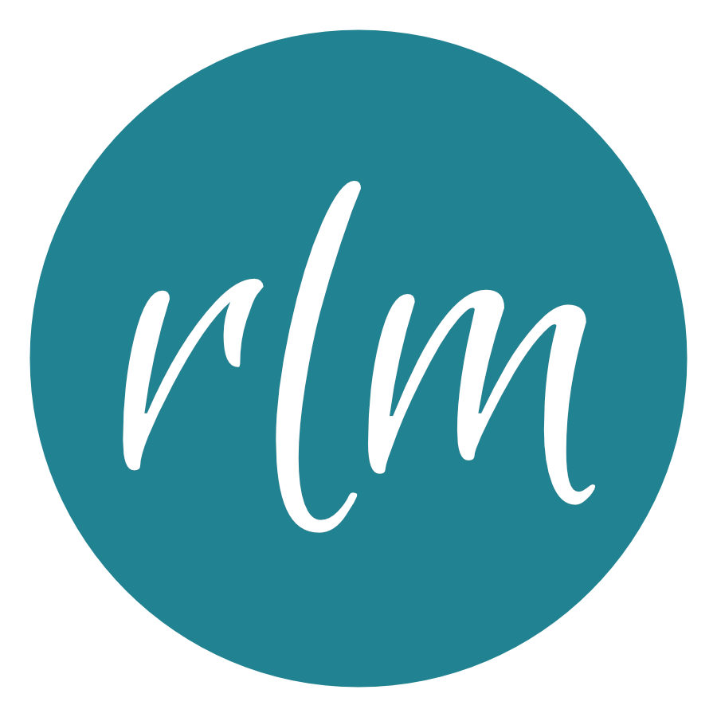

# Hello, World!
I'm Rachel Moser, a Ruby on Rails Developer that highly values testing. I spend my time learning new tools to add to my toolbox and maintaining [The Odin Project](https://www.theodinproject.com) an open source, project-based web development curriculum.

## Learn More
You can learn more about my projects at [rlmoser.com](https://rlmoser.com/) or my background on [LinkedIn](https://www.linkedin.com/in/rlmoser99/).

## Technologies & Tools

## Stats

